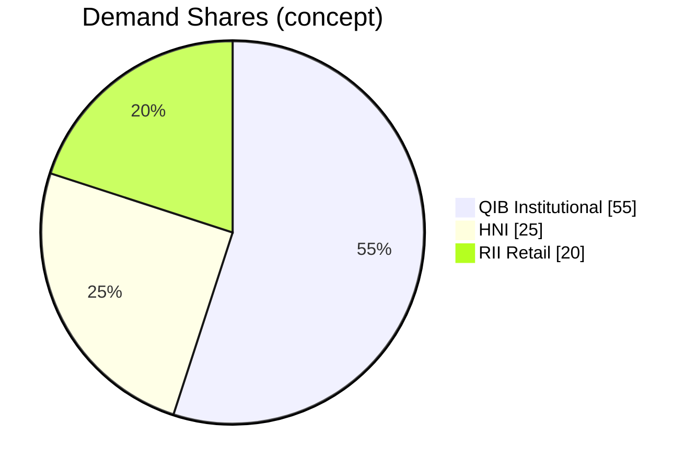
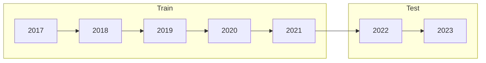

# 📈 IPO Listing-Day Pop Prediction (CRISP-DM)

[](#)
[](#)
[](#)
[](#)
[](https://colab.research.google.com/github/DMgaming00/CMPE-255-Data-mining/blob/main/ipo-listing-pop-crispdm/notebooks/project.ipynb)

Predict whether an IPO will **pop on day one** using only **pre-listing** information (offer price, issue size, investor demand mix).  
This repo implements a clean, reproducible **CRISP-DM** pipeline with **time-aware evaluation**.

> **TL;DR:** Clean features + **chronological** validation > flashy black boxes for tabular IPOs in 2025.  
> Tree ensembles (XGBoost/GBM) led on **ROC-AUC**; **QIB share** (institutional demand) was a top signal.

---

## 🔗 Project Links

- **Repo path:** https://github.com/DMgaming00/CMPE-255-Data-mining/tree/main/ipo-listing-pop-crispdm  
- **Open in Colab:** https://colab.research.google.com/github/DMgaming00/CMPE-255-Data-mining/blob/main/ipo-listing-pop-crispdm/notebooks/project.ipynb  
- **(Optional) Kaggle dataset:** _Add your dataset URL here_ → e.g., `https://www.kaggle.com/...`

---

## 🗂️ Project Structure

```
ipo-listing-pop-crispdm/
├── data/                          # Place your Excel dataset here
│   └── Initial Public Offering.xlsx
├── notebooks/
│   └── project.ipynb              # One-click runner notebook
├── src/
│   └── analysis.py                # End-to-end CRISP-DM pipeline
├── reports/                       # Auto-generated plots & tables
│   ├── roc_curves.png
│   ├── model_metrics.csv
│   ├── cm_RandomForest.png
│   ├── hist_offer_price_num.png
│   └── trend_avg_listing_gain_by_year.png
├── artifacts/                     # Saved model + schema
│   ├── model_<BestModel>.joblib
│   └── feature_columns.csv
├── README.md
└── requirements.txt
```

---

## 💾 Dataset

- **Fields (typical):** offer price, issue size (₹ crores), investor demand by **QIB/HNI/RII**, IPO open date, sector.  
- **Target:** `listing_gain > 0` ⇒ **pop (1)** else **no-pop (0)**.  
- **Leakage guard:** **exclude** any post-listing signals (e.g., list price, realized gains).

> Replace the placeholder above with the real Kaggle URL once you have it.

---

## 🧭 CRISP-DM (At a Glance)


**Principles:** time-aware, leakage-safe, reproducible, explainable.

> GitHub Mermaid tips: keep labels in **quotes** and avoid parentheses; use hyphens or slashes for clarity.

---

## ⚡ Quickstart

```bash
# 1) Create & activate a virtual environment
python -m venv .venv
# Windows: .venv\Scriptsctivate
# macOS/Linux:
source .venv/bin/activate

# 2) Install dependencies
pip install -r requirements.txt

# 3) Put your dataset in data/
#    e.g., data/Initial Public Offering.xlsx

# 4) Run the pipeline (generates plots under reports/)
python src/analysis.py --data "data/Initial Public Offering.xlsx"
```

Or open `notebooks/project.ipynb` and run the cells.

---

## 🔁 What the Pipeline Does

1. **EDA** — schema & missingness audit, distributions, relationships, time trends.  
2. **Prep** — median imputation; **IQR winsorization** for heavy tails; minimal one-hot; **RobustScaler**.  
3. **Features** — year/quarter/month, `post_2020`, **QIB/HNI/RII shares & totals**, `log(issue_size)`, simple interactions.  
4. **Modeling** — chronological split; **LogReg**, **RandomForest**, **XGBoost/GBM** (fallback), **small MLP**.  
5. **Evaluation** — Accuracy, Precision/Recall, **F1**, **ROC-AUC**; ROC curves & confusion matrices.  
6. **Artifacts** — best model `.joblib`, feature schema, metrics and plots under `reports/`.

**Concept: Demand Mix (illustrative)**



**Concept: Chronological Split (GitHub-safe alternative to 'timeline')**



---

## 🏆 Key Results (Representative)

| Model               | Accuracy |   F1  | ROC-AUC |
|---------------------|--------:|------:|--------:|
| Logistic Regression |   0.69  |  0.68 |   0.73  |
| Random Forest       |   0.72  |  0.71 |   0.77  |
| **XGBoost**         | **0.74**|**0.73**|**0.80** |
| MLP (small)         |   0.70  |  0.69 |   0.74  |

> Metrics will vary by dataset version and timeframe; the script writes your run to `reports/model_metrics.csv`.

> Quadrant/landscape diagrams are not consistently supported on GitHub Mermaid. Use the table above instead.

---

## 🖼️ Visual Gallery (generated under `reports/`)

- **ROC Curves** — `reports/roc_curves.png`  
- **Scorecard Bars** — generate from `reports/model_metrics.csv` (see snippet below)  
- **Confusion Matrix (example: RF)** — `reports/cm_RandomForest.png`  
- **Offer Price Distribution** — `reports/hist_offer_price_num.png`  
- **Avg. Listing Gain by Year** — `reports/trend_avg_listing_gain_by_year.png`  

> You can create a **scorecard bar chart** from `model_metrics.csv`:

```python
import pandas as pd, matplotlib.pyplot as plt
m = pd.read_csv("reports/model_metrics.csv")
fig, ax = plt.subplots(1,3, figsize=(12,4))
for i, col in enumerate(["test_ROC_AUC","test_F1","test_Accuracy"]):
    m.plot(x="Model", y=col, kind="bar", ax=ax[i], legend=False)
    ax[i].set_title(col.replace("test_","Test "))
    ax[i].set_ylim(0,1)
plt.suptitle("Model Scorecard (Test)"); plt.tight_layout()
plt.savefig("reports/scorecard_bars.png", dpi=200)
```

---

## 🛠️ How It Works

### Feature Highlights
- **Demand composition:** `qib_share`, `hni_share`, `rii_share`, `total_demand`  
- **Scale & regime:** `log1p(issue_size)`, `post_2020`  
- **Interactions:** `size × demand`, `QIB × offer_price`

### Why Trees Win Here
- Handle **non-linearities** & **mixed scales**  
- Robust to mild outliers (after clipping)  
- Strong ranking power (**ROC-AUC**) with modest tuning

### Leakage Guardrails
- Use **only** features known **before** trading  
- **Chronological** split to avoid time leakage

---

## 🧭 Roadmap

- Probability **calibration** + threshold tuning to business cost  
- **Sector & macro** features (vol, index regimes, sector heat)  
- **Explainability** (SHAP) + drift monitoring  
- **Time-series CV** (rolling/blocked)  
- Lightweight **FastAPI** scoring + Dockerfile

---

## 🙏 Acknowledgments

- Data: **Kaggle — IPO dataset** (_replace with the real link and credit the author/license_)  
- Libraries: `pandas`, `numpy`, `scikit-learn`, `xgboost`, `matplotlib`, `openpyxl`

---

## 📜 License

This project is released under the **MIT License**. See `LICENSE` for details.
